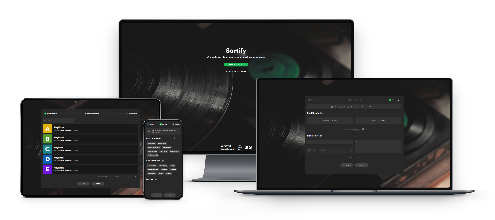

#  Sortify

## About the project

Sortify is a **single-page application** that aims to help people organize their Spotify libraries.
It uses **Spotify Web API** to fetch, sort and create playlists. All that, while being very simple and friendly to use.

**Try it now on [sortify.it](https://www.sortify.it)** :point_left:

## Technologies

Sortify was made with **ASP&#46;NET Core 3.1** and **Angular 11.** It connects to user's Spotify account using **OAuth 2** and **OpenId Connect.**

### Front-end libraries

- [Angular-oauth2-oidc](https://www.npmjs.com/package/angular-oauth2-oidc/v/8.0.4) for logging in.
- [Lodash](https://www.npmjs.com/package/@types/lodash/v/4.14.168) for additional JS utility.
- [SortableJS](https://www.npmjs.com/package/ngx-sortablejs/v/3.1.4) for drag & drop.

### Back-end libraries

- [AutoMapper](https://www.nuget.org/packages/AutoMapper/10.0.0) for convention-based object mapping.
- [Castle Windsor](https://www.nuget.org/packages/Castle.Windsor/5.0.1) for inversion of control container.
- [Dynamic LINQ](https://www.nuget.org/packages/System.Linq.Dynamic.Core/1.2.5) for advanced ordering.
- [NLog](https://www.nuget.org/packages/NLog.Extensions.Logging/1.6.5) for server side logging.
- [NUnit](https://www.nuget.org/packages/NUnit/3.13.1) for unit testing.
- [SignalR](https://www.nuget.org/packages/Microsoft.AspNetCore.SignalR/1.1.0) for real-time bi-directional communication.
- [SpotifyAPI.Web](https://www.nuget.org/packages/SpotifyAPI.Web/6.0.0-beta.12) for communication with Spotify Web API.
- [Swagger](https://www.nuget.org/packages/Swashbuckle.AspNetCore/5.6.3) for documenting API.

**If you like this project, consider giving it a :star: or... 😄**

